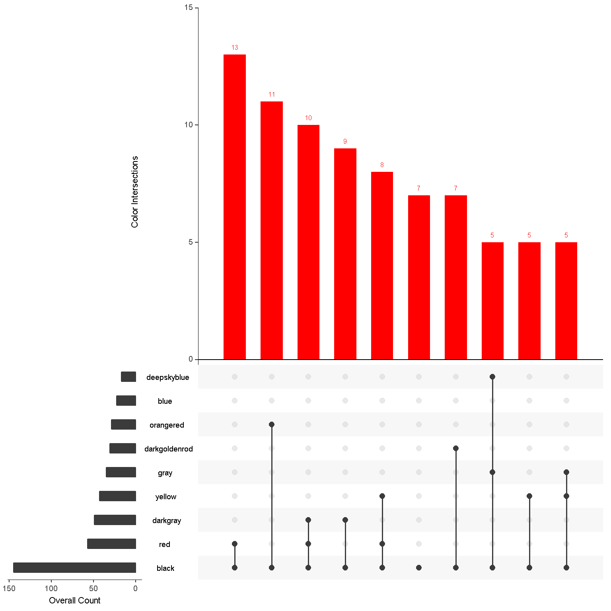
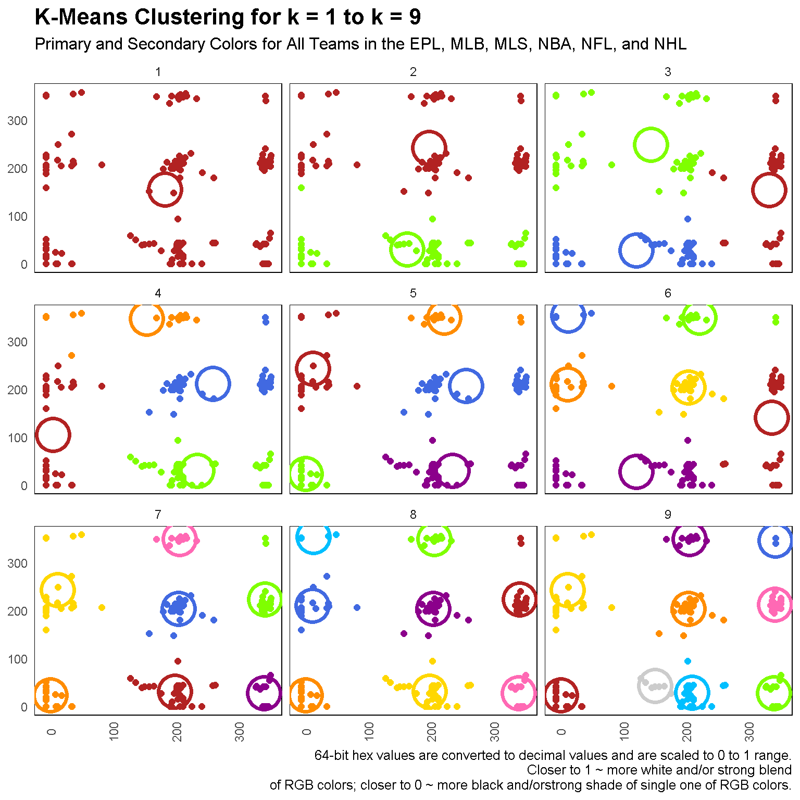
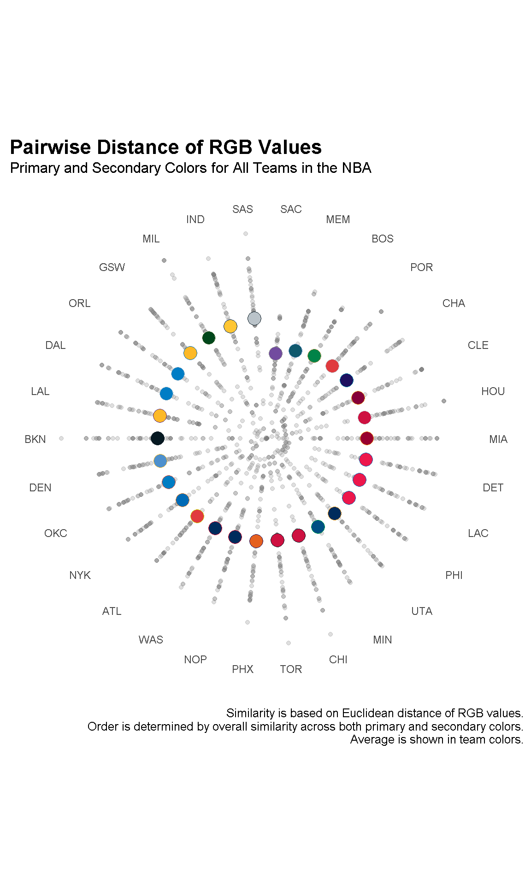
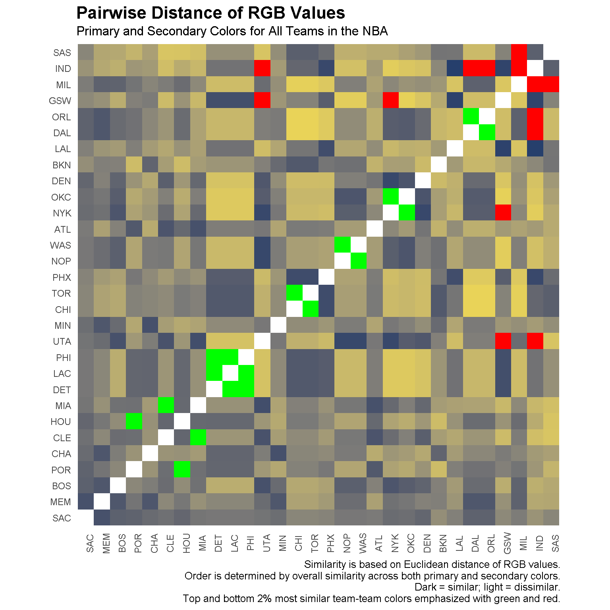

# Introduction

See my blog posts [here](https://tonyelhabr.rbind.io/posts/sports-colors-analysis-r/)
and [here](https://tonyelhabr.rbind.io/posts/sports-colors-analysis-r-2/)
for the full write-ups, or, check out the `.html` files in the `R/` directory
in this repo, which was used as the basis for the blog post.
The `figs/` directory also contains some of the visualizations in the post.

# Highlights

Here are a couple of the coolest visualization, in my opinion.

