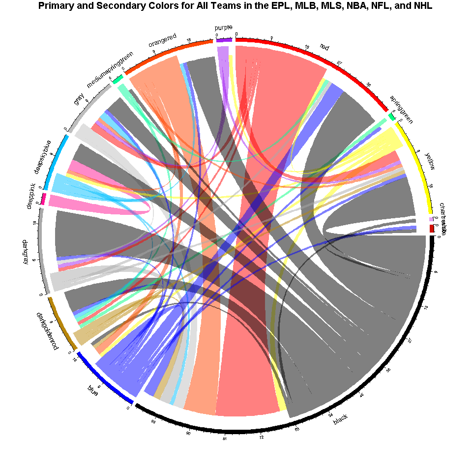

Analysis of Sport Team Colors, Part 1
================
2018-03-27

When working with the [`ggplot2` package](http://ggplot2.org/), I often find myself playing around with colors for longer than I probably should be. I think that this is because I know that the right color scheme can greatly enhance the information that a plot portrays; and, conversely, choosing an uncomplimentary palette can suppress the message of an otherwise good visualization.

With that said, I wanted to take a look at the presence of colors in the sports realm. I think some fun insight can be had from an exploration of colors used by individual sports teams. Some people have done some interesting technical research on this topic, such as studying [the possible effects of color on fan and player perception of teams](http://www.open.edu/openlearn/health-sports-psychology/health/sport-and-fitness/sport/the-colour-success-can-uniform-colour-impact-on-team-success).

Setup
-----

**Technical Notes**

-   I show code only where I believe it complements the commentary throughout; otherwise, it is hidden. Nonetheless, the underlying code can be viewed in the raw .Rmd file for this write-up.

-   Although I list all of the packages used in this write-up (for the sake of reproducibility), I comment out those that are used only in an explicit manner (i.e. via the "`package::function`" syntax). (Only `dplyr` and `ggplot2` are imported altogether). Minimizing the namespace in this manner is a personal convention.

``` r
library("dplyr")
# library("teamcolors")
library("ggplot2")
# library("tidyr")
# library("tibble")
# library("purrr")
# library("stringr")
# library("stringi")
# library("nbastatR")
# library("nflscrapR")
# library("UpSetR")
# library("factoextra")
# library("NbClust")
# library("corrr")
# library("GGally")
# library("viridis)
# library("corrr")
# library("igraph")
# library("ggraph")
# library("circlize")
```

The data that I'll use comes from the [teamcolors R package](https://github.com/beanumber/teamcolors), which itself is sourced from [Jim Nielsen's website for team colors](http://jim-nielsen.com/teamcolors/). This data set provides color information for all teams from six professional sports leagues:

-   EPL (European futbol),
-   MLB (baseball),
-   MLS (American soccer),
-   NBA (basketball),
-   NFL (American football), and
-   NHL (hockey).

``` r
teamcolors::teamcolors %>% create_kable()
```

<table class="table" style="width: auto !important; margin-left: auto; margin-right: auto;">
<thead>
<tr>
<th style="text-align:left;">
name
</th>
<th style="text-align:left;">
league
</th>
<th style="text-align:left;">
primary
</th>
<th style="text-align:left;">
secondary
</th>
<th style="text-align:left;">
tertiary
</th>
<th style="text-align:left;">
quaternary
</th>
</tr>
</thead>
<tbody>
<tr>
<td style="text-align:left;">
AFC Bournemouth
</td>
<td style="text-align:left;">
epl
</td>
<td style="text-align:left;">
\#e62333
</td>
<td style="text-align:left;">
\#000000
</td>
<td style="text-align:left;">
NA
</td>
<td style="text-align:left;">
NA
</td>
</tr>
<tr>
<td style="text-align:left;">
Anaheim Ducks
</td>
<td style="text-align:left;">
nhl
</td>
<td style="text-align:left;">
\#010101
</td>
<td style="text-align:left;">
\#a2aaad
</td>
<td style="text-align:left;">
\#fc4c02
</td>
<td style="text-align:left;">
\#85714d
</td>
</tr>
<tr>
<td style="text-align:left;">
Arizona Cardinals
</td>
<td style="text-align:left;">
nfl
</td>
<td style="text-align:left;">
\#97233f
</td>
<td style="text-align:left;">
\#000000
</td>
<td style="text-align:left;">
\#ffb612
</td>
<td style="text-align:left;">
\#a5acaf
</td>
</tr>
<tr>
<td style="text-align:left;">
Arizona Coyotes
</td>
<td style="text-align:left;">
nhl
</td>
<td style="text-align:left;">
\#010101
</td>
<td style="text-align:left;">
\#862633
</td>
<td style="text-align:left;">
\#ddcba4
</td>
<td style="text-align:left;">
NA
</td>
</tr>
<tr>
<td style="text-align:left;">
Arizona Diamondbacks
</td>
<td style="text-align:left;">
mlb
</td>
<td style="text-align:left;">
\#a71930
</td>
<td style="text-align:left;">
\#000000
</td>
<td style="text-align:left;">
\#e3d4ad
</td>
<td style="text-align:left;">
NA
</td>
</tr>
<tr>
<td style="text-align:left;">
Arsenal
</td>
<td style="text-align:left;">
epl
</td>
<td style="text-align:left;">
\#ef0107
</td>
<td style="text-align:left;">
\#023474
</td>
<td style="text-align:left;">
\#9c824a
</td>
<td style="text-align:left;">
NA
</td>
</tr>
<tr>
<td style="text-align:left;">
Atlanta Braves
</td>
<td style="text-align:left;">
mlb
</td>
<td style="text-align:left;">
\#ce1141
</td>
<td style="text-align:left;">
\#13274f
</td>
<td style="text-align:left;">
NA
</td>
<td style="text-align:left;">
NA
</td>
</tr>
<tr>
<td style="text-align:left;">
Atlanta Falcons
</td>
<td style="text-align:left;">
nfl
</td>
<td style="text-align:left;">
\#a71930
</td>
<td style="text-align:left;">
\#000000
</td>
<td style="text-align:left;">
\#a5acaf
</td>
<td style="text-align:left;">
\#a30d2d
</td>
</tr>
<tr>
<td style="text-align:left;">
Atlanta Hawks
</td>
<td style="text-align:left;">
nba
</td>
<td style="text-align:left;">
\#e13a3e
</td>
<td style="text-align:left;">
\#c4d600
</td>
<td style="text-align:left;">
\#061922
</td>
<td style="text-align:left;">
NA
</td>
</tr>
<tr>
<td style="text-align:left;">
Atlanta United FC
</td>
<td style="text-align:left;">
mls
</td>
<td style="text-align:left;">
\#a29061
</td>
<td style="text-align:left;">
\#80000b
</td>
<td style="text-align:left;">
\#000000
</td>
<td style="text-align:left;">
NA
</td>
</tr>
</tbody>
<tfoot>
<tr>
<td style="padding: 0; border:0;" colspan="100%">
<sup>1</sup> \# of total rows: 165
</td>
</tr>
</tfoot>
</table>
Putting this data in a "tidy" format is rather straightforward. [1] [2]

``` r
colors_tidy <-
  teamcolors::teamcolors %>%
  tidyr::gather(ord, hex, -name, -league)
colors_tidy %>% create_kable()
```

<table class="table" style="width: auto !important; margin-left: auto; margin-right: auto;">
<thead>
<tr>
<th style="text-align:left;">
name
</th>
<th style="text-align:left;">
league
</th>
<th style="text-align:left;">
ord
</th>
<th style="text-align:left;">
hex
</th>
</tr>
</thead>
<tbody>
<tr>
<td style="text-align:left;">
AFC Bournemouth
</td>
<td style="text-align:left;">
epl
</td>
<td style="text-align:left;">
primary
</td>
<td style="text-align:left;">
\#e62333
</td>
</tr>
<tr>
<td style="text-align:left;">
Anaheim Ducks
</td>
<td style="text-align:left;">
nhl
</td>
<td style="text-align:left;">
primary
</td>
<td style="text-align:left;">
\#010101
</td>
</tr>
<tr>
<td style="text-align:left;">
Arizona Cardinals
</td>
<td style="text-align:left;">
nfl
</td>
<td style="text-align:left;">
primary
</td>
<td style="text-align:left;">
\#97233f
</td>
</tr>
<tr>
<td style="text-align:left;">
Arizona Coyotes
</td>
<td style="text-align:left;">
nhl
</td>
<td style="text-align:left;">
primary
</td>
<td style="text-align:left;">
\#010101
</td>
</tr>
<tr>
<td style="text-align:left;">
Arizona Diamondbacks
</td>
<td style="text-align:left;">
mlb
</td>
<td style="text-align:left;">
primary
</td>
<td style="text-align:left;">
\#a71930
</td>
</tr>
<tr>
<td style="text-align:left;">
Arsenal
</td>
<td style="text-align:left;">
epl
</td>
<td style="text-align:left;">
primary
</td>
<td style="text-align:left;">
\#ef0107
</td>
</tr>
<tr>
<td style="text-align:left;">
Atlanta Braves
</td>
<td style="text-align:left;">
mlb
</td>
<td style="text-align:left;">
primary
</td>
<td style="text-align:left;">
\#ce1141
</td>
</tr>
<tr>
<td style="text-align:left;">
Atlanta Falcons
</td>
<td style="text-align:left;">
nfl
</td>
<td style="text-align:left;">
primary
</td>
<td style="text-align:left;">
\#a71930
</td>
</tr>
<tr>
<td style="text-align:left;">
Atlanta Hawks
</td>
<td style="text-align:left;">
nba
</td>
<td style="text-align:left;">
primary
</td>
<td style="text-align:left;">
\#e13a3e
</td>
</tr>
<tr>
<td style="text-align:left;">
Atlanta United FC
</td>
<td style="text-align:left;">
mls
</td>
<td style="text-align:left;">
primary
</td>
<td style="text-align:left;">
\#a29061
</td>
</tr>
</tbody>
<tfoot>
<tr>
<td style="padding: 0; border:0;" colspan="100%">
<sup>1</sup> \# of total rows: 660
</td>
</tr>
</tfoot>
</table>
Exploration
-----------

To begin, here's visualization of all the colors in this data set. Not much significance can be extracted from this plot, but it's still nice to have as a mechanism for getting familiar with the data.


### Color Brightness

Note that there are quite a few teams without a full set of four colors (and some without a third or even second color).


``` r
colors_pct_nas <-
  colors_tidy %>%
  count(league, is_na = is.na(hex), sort = TRUE) %>%
  filter(is_na) %>%
  select(-is_na) %>%
  left_join(
    teamcolors::teamcolors %>%
      count(league, sort = TRUE) %>%
      rename(total = n) %>%
      mutate(total = as.integer(4 * total)),
    by = "league"
  ) %>%
  mutate(n_pct = 100 * n / total) %>% 
  mutate_if(is.numeric, funs(round(., 2)))
colors_pct_nas %>% create_kable()
```

<table class="table" style="width: auto !important; margin-left: auto; margin-right: auto;">
<thead>
<tr>
<th style="text-align:left;">
league
</th>
<th style="text-align:right;">
n
</th>
<th style="text-align:right;">
total
</th>
<th style="text-align:right;">
n\_pct
</th>
</tr>
</thead>
<tbody>
<tr>
<td style="text-align:left;">
mlb
</td>
<td style="text-align:right;">
47
</td>
<td style="text-align:right;">
120
</td>
<td style="text-align:right;">
39.17
</td>
</tr>
<tr>
<td style="text-align:left;">
nhl
</td>
<td style="text-align:right;">
42
</td>
<td style="text-align:right;">
124
</td>
<td style="text-align:right;">
33.87
</td>
</tr>
<tr>
<td style="text-align:left;">
epl
</td>
<td style="text-align:right;">
34
</td>
<td style="text-align:right;">
80
</td>
<td style="text-align:right;">
42.50
</td>
</tr>
<tr>
<td style="text-align:left;">
mls
</td>
<td style="text-align:right;">
20
</td>
<td style="text-align:right;">
88
</td>
<td style="text-align:right;">
22.73
</td>
</tr>
<tr>
<td style="text-align:left;">
nba
</td>
<td style="text-align:right;">
19
</td>
<td style="text-align:right;">
120
</td>
<td style="text-align:right;">
15.83
</td>
</tr>
<tr>
<td style="text-align:left;">
nfl
</td>
<td style="text-align:right;">
2
</td>
<td style="text-align:right;">
128
</td>
<td style="text-align:right;">
1.56
</td>
</tr>
</tbody>
</table>
Both the visualization and the tabulation indicate that the MLB is missing the most colors (on a per-team basis). Perhaps this suggests that it is the most "dull" sports league. [3] The NFL is on the other end of the spectrum (pun intended), with only 1.5% of missing color values. Is it a coincidence that the [NFL is the most popular sport in the U.S.](http://news.gallup.com/poll/224864/football-americans-favorite-sport-watch.aspx)? [4]

My subjective indictment of MLB as dull is certainly unfair and unquantitative. Does "dull" refer to [hue, lightness, brightness, etc.](https://en.wikipedia.org/wiki/Color_appearance_model#Color_appearance_parameters)? For the sake of argument, let's say that I want to interpret dullness as ["brightness"](https://en.wikipedia.org/wiki/Brightness), which, in the color lexicon, is interpreted as the arithmetic mean of the [red-green-blue](https://en.wikipedia.org/wiki/RGB_color_model) (RGB) values of a color. To rank the leagues by brightness, I can take the average of the RGB values (derived from the hex values) across all colors for all teams in each league. The resulting values--where a lower value indicates a darker color, and a higher value indicates a brighter color--provide a fair measure upon which each league's aggregate color choices can be judged. [5]

``` r
add_rgb_cols <- function(data) {
  data %>%
    pull(hex) %>%
    grDevices::col2rgb() %>%
    t() %>%
    tibble::as_tibble() %>%
    bind_cols(data, .) 
}

rank_leagues_byrgb <- function(data = NULL) {
  colors_rgb <-
    data %>%
    add_rgb_cols() %>%
    select(-hex) %>%
    arrange(league, name)
  
  colors_rgb_bynm_bylg <-
    colors_rgb %>%
    mutate_at(vars(red, green, blue), funs(. / 255)) %>%
    group_by(name, league) %>%
    summarize_at(vars(red, green, blue), funs(mean)) %>%
    ungroup() %>%
    tidyr::gather(rgb, value, red, green, blue) %>%
    group_by(name, league) %>%
    summarize_at(vars(value), funs(mean, sd)) %>%
    ungroup() %>%
    arrange(league, mean)
  
  colors_rgb_bylg <-
    colors_rgb_bynm_bylg %>%
    group_by(league) %>%
    summarize_at(vars(mean, sd), funs(mean)) %>%
    ungroup() %>%
    arrange(mean)
  colors_rgb_bylg
}

convert_dec2pct <- function(x) {
  100 * round(x, 4)
}
```

``` r
colors_tidy_nona <-
  colors_tidy %>%
  filter(!is.na(hex))


colors_tidy_nona %>% 
  rank_leagues_byrgb() %>%
  arrange(mean) %>% 
  mutate_if(is.numeric, funs(convert_dec2pct)) %>% 
  create_kable()
```

<table class="table" style="width: auto !important; margin-left: auto; margin-right: auto;">
<thead>
<tr>
<th style="text-align:left;">
league
</th>
<th style="text-align:right;">
mean
</th>
<th style="text-align:right;">
sd
</th>
</tr>
</thead>
<tbody>
<tr>
<td style="text-align:left;">
nhl
</td>
<td style="text-align:right;">
30.46
</td>
<td style="text-align:right;">
14.52
</td>
</tr>
<tr>
<td style="text-align:left;">
nfl
</td>
<td style="text-align:right;">
32.90
</td>
<td style="text-align:right;">
12.68
</td>
</tr>
<tr>
<td style="text-align:left;">
mlb
</td>
<td style="text-align:right;">
33.75
</td>
<td style="text-align:right;">
13.16
</td>
</tr>
<tr>
<td style="text-align:left;">
epl
</td>
<td style="text-align:right;">
36.56
</td>
<td style="text-align:right;">
15.79
</td>
</tr>
<tr>
<td style="text-align:left;">
mls
</td>
<td style="text-align:right;">
38.59
</td>
<td style="text-align:right;">
12.05
</td>
</tr>
<tr>
<td style="text-align:left;">
nba
</td>
<td style="text-align:right;">
40.99
</td>
<td style="text-align:right;">
10.37
</td>
</tr>
</tbody>
</table>
This calculation proves what we might have guessed by inspection--the NHL actually has the darkest colors. In fact, it seems that the NHL's "darkness" is most prominent in the primary colors of the teams in the league.

``` r
colors_tidy_nona %>% 
  filter(ord == "primary") %>% 
  rank_leagues_byrgb() %>% 
  arrange(mean) %>% 
  mutate_if(is.numeric, funs(convert_dec2pct)) %>% 
  create_kable()
```

<table class="table" style="width: auto !important; margin-left: auto; margin-right: auto;">
<thead>
<tr>
<th style="text-align:left;">
league
</th>
<th style="text-align:right;">
mean
</th>
<th style="text-align:right;">
sd
</th>
</tr>
</thead>
<tbody>
<tr>
<td style="text-align:left;">
nhl
</td>
<td style="text-align:right;">
9.13
</td>
<td style="text-align:right;">
9.20
</td>
</tr>
<tr>
<td style="text-align:left;">
nfl
</td>
<td style="text-align:right;">
23.42
</td>
<td style="text-align:right;">
18.69
</td>
</tr>
<tr>
<td style="text-align:left;">
mlb
</td>
<td style="text-align:right;">
29.90
</td>
<td style="text-align:right;">
29.00
</td>
</tr>
<tr>
<td style="text-align:left;">
mls
</td>
<td style="text-align:right;">
32.16
</td>
<td style="text-align:right;">
22.74
</td>
</tr>
<tr>
<td style="text-align:left;">
epl
</td>
<td style="text-align:right;">
37.35
</td>
<td style="text-align:right;">
29.10
</td>
</tr>
<tr>
<td style="text-align:left;">
nba
</td>
<td style="text-align:right;">
37.95
</td>
<td style="text-align:right;">
30.10
</td>
</tr>
</tbody>
</table>
On the other hand, the NBA and the two soccer leagues (the MLS and the EPL) stand out as the leagues with the "brightest" colors.

Finally, just by inspection, it seems like their is an unusual pattern where a disproportionate number of teams in the MLS, NBA, and NFL have shades of gray as their tertiary colors. Using the same function as before, it can be shown indirectly via relatively small standard deviation values that there is not much variation in this color.

``` r
colors_tidy_nona %>% 
  filter(ord == "tertiary") %>% 
  rank_leagues_byrgb() %>%
  arrange(sd) %>% 
  mutate_if(is.numeric, funs(convert_dec2pct)) %>% 
  create_kable()
```

<table class="table" style="width: auto !important; margin-left: auto; margin-right: auto;">
<thead>
<tr>
<th style="text-align:left;">
league
</th>
<th style="text-align:right;">
mean
</th>
<th style="text-align:right;">
sd
</th>
</tr>
</thead>
<tbody>
<tr>
<td style="text-align:left;">
nba
</td>
<td style="text-align:right;">
34.23
</td>
<td style="text-align:right;">
9.39
</td>
</tr>
<tr>
<td style="text-align:left;">
nfl
</td>
<td style="text-align:right;">
36.98
</td>
<td style="text-align:right;">
12.48
</td>
</tr>
<tr>
<td style="text-align:left;">
mls
</td>
<td style="text-align:right;">
48.81
</td>
<td style="text-align:right;">
14.13
</td>
</tr>
<tr>
<td style="text-align:left;">
epl
</td>
<td style="text-align:right;">
49.57
</td>
<td style="text-align:right;">
23.89
</td>
</tr>
<tr>
<td style="text-align:left;">
nhl
</td>
<td style="text-align:right;">
42.10
</td>
<td style="text-align:right;">
28.15
</td>
</tr>
<tr>
<td style="text-align:left;">
mlb
</td>
<td style="text-align:right;">
56.64
</td>
<td style="text-align:right;">
29.93
</td>
</tr>
</tbody>
</table>
### Common Colors

Using a slightly customized version of the `plotrix::color.id()` function, I can attempt to identify common colors (by name) from the hex values.

``` r
# Reference:
# + plotrix::color.id
color_id <- function(hex, set = grDevices::colors()) {
  c2 <- grDevices::col2rgb(hex)
  coltab <- grDevices::col2rgb(set)
  cdist <- apply(coltab, 2, function(z) sum((z - c2)^2))
  set[which(cdist == min(cdist))]
}

identify_color_name <- function(col = NULL, set = grDevices::colors()) {
  col %>%
    # purrr::map(plotrix::color.id) %>% 
    purrr::map(~color_id(.x, set)) %>% 
    purrr::map_chr(~.[1]) %>% 
    stringr::str_replace_all("[0-9]", "")
}
```

I'll bin the possible colors into a predefined set. (If a binning strategy is not implemented, one ends up with a more sparse, less meaningful grouping of colors.) This set consists of the "rainbow" colors, as well as black, white, and two shades of grey.

``` r
colors_rnbw_hex <-
  c(
    stringr::str_replace_all(grDevices::rainbow(16), "FF$", ""),
    "#FFFFFF",
    "#EEEEEE",
    "#AAAAAA",
    "#000000"
  )
colors_rnbw <- identify_color_name(colors_rnbw_hex)
```


Now, with the setup out of the way, I can easily compute the names of each color and identify the most common colors overall, as well as the most common primary and secondary colors.

``` r
add_color_nm_col <- function(data, rename = TRUE) {
  out <-
    data %>%
    pull(hex) %>%
    identify_color_name(set = colors_rnbw) %>% 
    tibble::as_tibble() %>% 
    bind_cols(data, .)
  
  if(rename) {
    out <-
      out %>% 
      rename(color_nm = value)
  }
  out
}

colors_named <-
  colors_tidy_nona %>%
  add_color_nm_col()
```

``` r
colors_named %>%
  count(color_nm, sort = TRUE) %>% 
  create_kable()
```

<table class="table" style="width: auto !important; margin-left: auto; margin-right: auto;">
<thead>
<tr>
<th style="text-align:left;">
color\_nm
</th>
<th style="text-align:right;">
n
</th>
</tr>
</thead>
<tbody>
<tr>
<td style="text-align:left;">
black
</td>
<td style="text-align:right;">
173
</td>
</tr>
<tr>
<td style="text-align:left;">
red
</td>
<td style="text-align:right;">
61
</td>
</tr>
<tr>
<td style="text-align:left;">
darkgray
</td>
<td style="text-align:right;">
55
</td>
</tr>
<tr>
<td style="text-align:left;">
yellow
</td>
<td style="text-align:right;">
43
</td>
</tr>
<tr>
<td style="text-align:left;">
gray
</td>
<td style="text-align:right;">
36
</td>
</tr>
<tr>
<td style="text-align:left;">
darkgoldenrod
</td>
<td style="text-align:right;">
35
</td>
</tr>
<tr>
<td style="text-align:left;">
orangered
</td>
<td style="text-align:right;">
33
</td>
</tr>
<tr>
<td style="text-align:left;">
blue
</td>
<td style="text-align:right;">
26
</td>
</tr>
<tr>
<td style="text-align:left;">
deepskyblue
</td>
<td style="text-align:right;">
18
</td>
</tr>
<tr>
<td style="text-align:left;">
mediumspringgreen
</td>
<td style="text-align:right;">
4
</td>
</tr>
</tbody>
<tfoot>
<tr>
<td style="padding: 0; border:0;" colspan="100%">
<sup>1</sup> \# of total rows: 15
</td>
</tr>
</tfoot>
</table>
``` r
colors_named %>%
  count(ord, color_nm, sort = TRUE) %>% 
  filter(ord %in% c("primary", "secondary")) %>% 
  group_by(ord) %>% 
  mutate(rank_byord = row_number(desc(n))) %>% 
  do(head(., 5)) %>% 
  create_kable()
```

<table class="table" style="width: auto !important; margin-left: auto; margin-right: auto;">
<thead>
<tr>
<th style="text-align:left;">
ord
</th>
<th style="text-align:left;">
color\_nm
</th>
<th style="text-align:right;">
n
</th>
<th style="text-align:right;">
rank\_byord
</th>
</tr>
</thead>
<tbody>
<tr>
<td style="text-align:left;">
primary
</td>
<td style="text-align:left;">
black
</td>
<td style="text-align:right;">
75
</td>
<td style="text-align:right;">
1
</td>
</tr>
<tr>
<td style="text-align:left;">
primary
</td>
<td style="text-align:left;">
red
</td>
<td style="text-align:right;">
26
</td>
<td style="text-align:right;">
2
</td>
</tr>
<tr>
<td style="text-align:left;">
primary
</td>
<td style="text-align:left;">
blue
</td>
<td style="text-align:right;">
16
</td>
<td style="text-align:right;">
3
</td>
</tr>
<tr>
<td style="text-align:left;">
primary
</td>
<td style="text-align:left;">
orangered
</td>
<td style="text-align:right;">
14
</td>
<td style="text-align:right;">
4
</td>
</tr>
<tr>
<td style="text-align:left;">
primary
</td>
<td style="text-align:left;">
deepskyblue
</td>
<td style="text-align:right;">
6
</td>
<td style="text-align:right;">
5
</td>
</tr>
<tr>
<td style="text-align:left;">
secondary
</td>
<td style="text-align:left;">
black
</td>
<td style="text-align:right;">
46
</td>
<td style="text-align:right;">
1
</td>
</tr>
<tr>
<td style="text-align:left;">
secondary
</td>
<td style="text-align:left;">
red
</td>
<td style="text-align:right;">
19
</td>
<td style="text-align:right;">
2
</td>
</tr>
<tr>
<td style="text-align:left;">
secondary
</td>
<td style="text-align:left;">
yellow
</td>
<td style="text-align:right;">
19
</td>
<td style="text-align:right;">
3
</td>
</tr>
<tr>
<td style="text-align:left;">
secondary
</td>
<td style="text-align:left;">
darkgray
</td>
<td style="text-align:right;">
17
</td>
<td style="text-align:right;">
4
</td>
</tr>
<tr>
<td style="text-align:left;">
secondary
</td>
<td style="text-align:left;">
gray
</td>
<td style="text-align:right;">
12
</td>
<td style="text-align:right;">
5
</td>
</tr>
</tbody>
</table>
Of course, a visualization is always appreciated.

``` r
ords <- ord_nums %>% pull(ord)
color_nm_na <- "none"
colors_named_compl <-
  colors_named %>% 
  mutate(ord = factor(ord, levels = ords)) %>% 
  select(-hex, -league) %>% 
  tidyr::complete(name, ord, fill = list(color_nm = color_nm_na)) %>%
  tidyr::spread(ord, color_nm)

colors_named_compl_ord2 <- 
  colors_named_compl %>%
  filter(primary != secondary) %>% 
  count(primary, secondary, sort = TRUE) %>%
  filter(primary != "none") %>% 
  filter(secondary != "none")

colors_named_compl_ord2_ig <- 
  colors_named_compl_ord2 %>% 
  igraph::graph_from_data_frame()

igraph::V(colors_named_compl_ord2_ig)$node_label <- names(igraph::V(colors_named_compl_ord2_ig))
igraph::V(colors_named_compl_ord2_ig)$node_size <- igraph::degree(colors_named_compl_ord2_ig)

lab_title_colors_named <- paste0("Colors", lab_base_suffix)
lab_subtitle_colors_named <- paste0("Relationships Among Primary and Secondary Colors")

# Reference:
# + https://rud.is/books/21-recipes/visualizing-a-graph-of-retweet-relationships.html.
viz_colors_named <-
  colors_named_compl_ord2_ig %>%
  ggraph::ggraph(layout = "linear", circular = TRUE) +
  # ggraph::ggraph(layout = "kk") +
  # ggraph::ggraph() +
  # ggraph::geom_edge_arc() +
  ggraph::geom_edge_arc(
    aes(
      edge_width = n / 3,
      # edge_alpha = n
      start_cap = ggraph::label_rect(node1.name, padding = margin(5, 5, 5, 5)),
      end_cap = ggraph::label_rect(node2.name, padding = margin(5, 5, 5, 5))
      )
    ) +
  ggraph::geom_node_text(aes(label = node_label)) +
  coord_fixed() +
  # teplot::theme_te()
  # ggraph::theme_graph(base_family = "Arial") +
  theme_void() +
  theme(plot.title = element_text(face = "bold", size = 16), plot.subtitle = element_text(size = 12)) +
  labs(title = lab_title_colors_named, subtitle = lab_subtitle_colors_named)
# viz_colors_named
```



Additionally, given the "set" nature of the data set, I think that the [{UpSetR} package](https://github.com/hms-dbmi/UpSetR) can be used to create an intersection-style graph. [6]

Neglecting the color black, which is unsurprisingly the most common color, red has the highest count. (Consequently, it is deserving of use as the fill for the bars in the following plot). [7] On the other hand, it's a bit unsuprising to me that blue, nor its its brethren in `cyan` and `deepskyblue`, isn't among the top 2 or 3. One might argue that the three shades of blue inherently cause classification to be "less focused", but this does not seem to curb the prominence of red, which also has two sister colors in `orangered` and `darkpink`.


### Color Clustering

Aside from set analysis, this data set seems prime for some [unsupervised learning](https://en.wikipedia.org/wiki/Unsupervised_learning), and, more specifically, [clustering](https://en.wikipedia.org/wiki/Cluster_analysis). While analysis of the colors using RGB values as features can be done (and is actually what I tried initially), the results are not as interpretable as I would like them to be due to the "&gt;2-dimensionality" nature of such an approach.

Thus, as an alternative to RGB components, I determined that ["hue"](https://en.wikipedia.org/wiki/Hue) serves as a reasonable all-in-one measure of the "essence" of a color. It is inherently a radial feature--its value can range from 0 to 360 (where red is 0 green is 120, blue is 240). [8]

Then, by limiting the color sets to just the primary and secondary colors (such that there are only 2 features), I create a setting that allows the clustering results to be interpeted (and visualized) in a relatively direct manner.

With my setup decided upon, I implement a a tidy pipeline for statistical analysis--making heavy use of [David Robinson](http://varianceexplained.org/)'s [{broom} package](https://github.com/tidyverse/broom)--to explore various values of k for a kmeans model. (The package's [kmeans vignette](https://cran.r-project.org/web/packages/broom/vignettes/kmeans.html) provides a really helpful example.)


While this visualization is fairly informative, it doesn't quite pinpoint exactly which value of k is "most optimal". There are \[various methods for determining the optimal k-value for a kmeans model\] (<http://www.sthda.com/english/articles/29-cluster-validation-essentials/96-determining-the-optimal-number-of-clusters-3-must-know-methods/>), one of which is the ["Elbow" method](https://bl.ocks.org/rpgove/0060ff3b656618e9136b). Basically, the point is to plot the within-cluster sum of squares (WSS) (i.e. variance) for each value of k--which is typically monotonically decreasing with increasing k--and pick the value of k that corresponds to the "bend" in the plot.


For those who enjoy calculus, the k value for which the second derivative of the curve is minimized is the optimal value (by the Elbow method).

``` r
kms_metrics$tot.withinss[1:8] %>% 
  diff(differences = 2) %>% 
  which.min() + 
  2
```

    ## [1] 7

To complement this conclusion, I can use the `fviz_nbclust()` function fom the [`factoextra` package](https://github.com/kassambara/factoextra). It deduces the optimal k value by the consensus of different methods.

It's nice to see that this method comes to the same conclusion.

I'll continue this analysis in a separate write-up. Unfortunately (or, perhaps, fortunately) there was too much to fit in a single document without it feeling overwhelming.

[1] The fact that the data comes in an easy-to-work-with format comes as a relief to those of us used to having to clean raw data tediously.

[2] Note that I use the name `ord` to represent "ordinality" of the color--that is, primary, secondary, tertiary, or quaternary.

[3] In fact, the current consensus among sports fans is that the [MLB has a decaying fan-base in the U.S. because it is failing to attract younger fans](https://www.huffingtonpost.com/laura-hanby-hudgens/the-decline-of-baseball-a_b_9630782.html). This opinion is typically based on conjectures about the game's slow pace, but, who knows, maybe colors also has something to do with it! (I'm only kidding. I pride myself in guarding against the [correlation-equals-causation fallacy](https://en.wikipedia.org/wiki/Correlation_does_not_imply_causation).)

[4] Again, in case you think I'm serious, let me be clear--yes, it is most likely a coincidence.

[5] *(More) Technical Notes*

-   I put this computation in a function because I perform the same actions multiple times. This practice complies with the [DRY](https://en.wikipedia.org/wiki/Don%27t_repeat_yourself) principle.

-   I was unable to get `grDevices::colo2rgb()` (and some other custom functions used elsewhere) to work in a vectorized manner, so I created a function (`add_rgb_cols()`) to do so. I believe the problem is that `grDevices::colo2rgb()` returns a matrix instead of a single value.

-   Additionally, despite only using one element in the returned list here, I wrote the function to return a list of results because I was inspecting the different sets of results during code development.

-   Finally, I re-scale each RGB value to a value between 0 and 1--RGB is typically expressed on a 0 to 255 scale--in order to make the final values more interpretable.

[6] After learning about the this package recently, I'm glad to finally have a use-case to use it!

[7] Unfortunately, it seems that customizing the colors for each set is not straightforward, so I do attempt it.

[8] Red is also 360.
